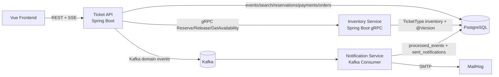
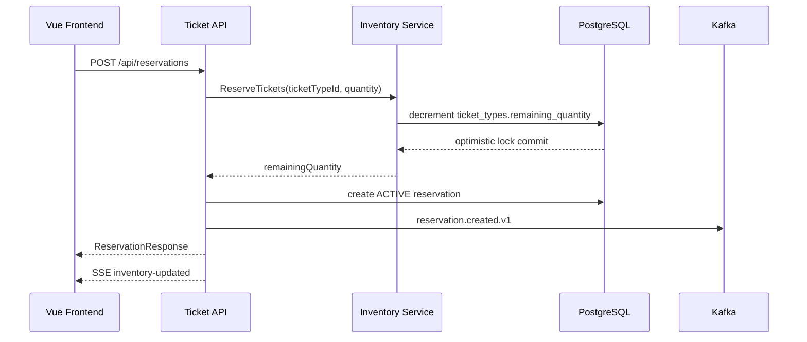
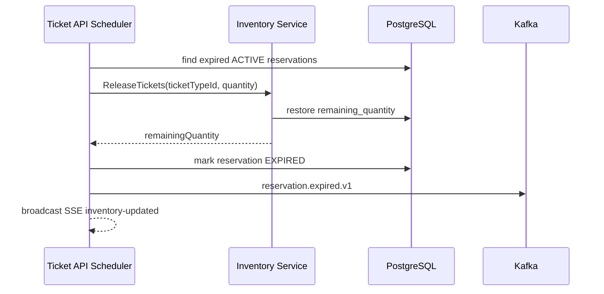
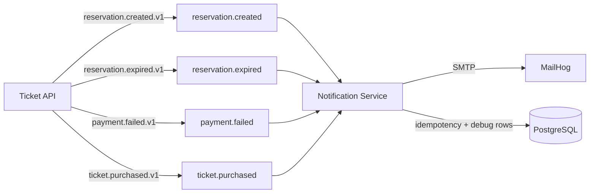
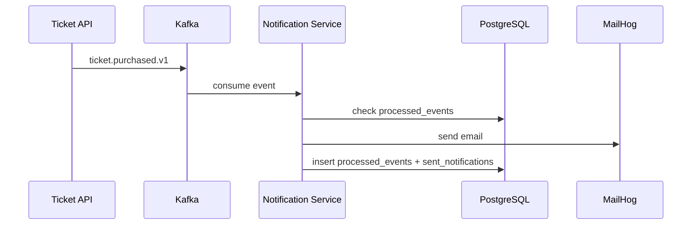

# Ticketmaster MVP Reservation Platform

Portfolio-grade ticketing platform evolved from an Inventory Reservation System into a Ticketmaster-style MVP.

Phase 2 adds gRPC, Kafka, and a Kafka-driven notification worker without replacing existing REST APIs or frontend flows.

## Architecture



## Services

| Service | Responsibility | Port |
| --- | --- | --- |
| frontend | Vue UI, EventSource SSE listener, notification debug page | `5173` |
| backend / Ticket API | REST API, search, reservations, payments, orders, SSE, Kafka producers, gRPC client | `8080` |
| inventory-service | Ticket inventory source of truth, optimistic locking, gRPC server | `9090` |
| notification-service | Kafka consumers, idempotency, email sending, retries, DLT | none |
| postgres | Shared data store | `5432` |
| kafka | Domain event broker | internal `9092`, host `9094` |
| zookeeper | Kafka coordination | `2181` |
| mailhog | Local email capture | SMTP `1025`, UI `8025` |

## Domain

```text
Event
└── TicketType
    └── remainingQuantity + @Version

Reservation -> TicketType
Payment -> Reservation
Order -> Reservation
```

`TicketType.remainingQuantity` is now owned by `inventory-service`.

## gRPC Contract

Proto file:

- `backend/src/main/proto/inventory.proto`
- `inventory-service/src/main/proto/inventory.proto`

Service:

```protobuf
service InventoryService {
  rpc ReserveTickets(ReserveTicketsRequest) returns (ReserveTicketsResponse);
  rpc ReleaseTickets(ReleaseTicketsRequest) returns (ReleaseTicketsResponse);
  rpc GetAvailability(GetAvailabilityRequest) returns (GetAvailabilityResponse);
}
```

## gRPC Reservation Flow



## gRPC Expiration Flow



## Kafka Topics

| Topic | Producer | Consumer | Purpose |
| --- | --- | --- | --- |
| `reservation.created` | Ticket API | Notification Service | Reservation email |
| `reservation.expired` | Ticket API | Notification Service | Expiration email |
| `reservation.cancelled` | Ticket API | future consumers | Cancellation event |
| `payment.succeeded` | Ticket API | future consumers | Payment audit/event demo |
| `payment.failed` | Ticket API | Notification Service | Failed payment email |
| `ticket.purchased` | Ticket API | Notification Service | Purchase confirmation email |
| `inventory.changed` | Ticket API | future consumers | Inventory event stream |

Dead-letter topics use `<topic>.DLT`.

## Event Contract

Events are immutable JSON payloads:

```json
{
  "eventId": "uuid",
  "eventType": "reservation.created.v1",
  "occurredAt": "2026-01-01T12:00:00Z",
  "reservationId": "36",
  "ticketTypeId": "4",
  "quantity": 1
}
```

## Kafka Event Flow



## Email Flow



## Notification Reliability

- Consumer group: `notification-service`
- Retry: `DefaultErrorHandler` with fixed backoff, 3 retries
- Dead letter: failed records go to `<topic>.DLT`
- Idempotency: `processed_events(event_id)` prevents duplicate email sends
- Debug rows: `sent_notifications` powers `/admin/notifications`

## Optimistic Locking

`TicketType` keeps JPA `@Version` in `inventory-service`.

Scenario:

```text
remainingQuantity = 10, version = 0
User A reserves 8
User B reserves 8

A commits -> remainingQuantity = 2, version = 1
B commits stale version -> optimistic lock conflict
Ticket API returns 409 Conflict
```

No pessimistic lock. No `SELECT FOR UPDATE`. Deliberate choice: fast normal path, explicit conflict under concurrent writes.

## PostgreSQL Search

Event search stays in Ticket API:

```text
GET /api/events/search?q=&page=&size=
```

Uses PostgreSQL only:

- `pg_trgm`
- `to_tsvector`
- `plainto_tsquery`
- `ts_rank`
- `similarity`
- pagination

No Elasticsearch, Redis, or external search engine.

## SSE Realtime Inventory

SSE stays in Ticket API:

```text
GET /api/tickets/{ticketTypeId}/watch
```

When inventory changes through gRPC, Ticket API emits:

```text
event: inventory-updated
data: { "ticketTypeId": 4, "remainingQuantity": 9999 }
```

Notification Service does not own SSE.

## Local Development

Start full platform:

```bash
make up
```

Stop:

```bash
make down
```

Logs:

```bash
make logs
```

Useful targets:

```bash
make backend
make frontend
make inventory
make notifications
make db
make clean
```

Open:

- Frontend: `http://localhost:5173`
- Backend API: `http://localhost:8080/api/events`
- Notification debug page: `http://localhost:5173/admin/notifications`
- MailHog: `http://localhost:8025`

## API

Existing REST API preserved:

- `GET /api/events`
- `GET /api/events/{id}`
- `GET /api/events/search?q=`
- `POST /api/events`
- `GET /api/reservations`
- `POST /api/reservations`
- `DELETE /api/reservations/{id}`
- `POST /api/payments`
- `GET /api/orders/{id}`
- `GET /api/tickets/{id}/watch`
- `GET /api/admin/notifications`

## Payment Simulator

| Card | Result |
| --- | --- |
| `4242424242424242` | `SUCCEEDED` |
| `4000000000000002` | `FAILED` |

Gateway simulates 1-3 seconds latency.

## Failure Scenarios

Inventory service down:

- Reservation creation fails because gRPC call cannot reserve stock.
- Existing event/search pages still load from Ticket API/PostgreSQL.

Concurrent reservation conflict:

- Inventory service optimistic lock fails.
- Ticket API maps conflict to `409 Conflict`.

Kafka down:

- Core reservation/payment DB work can complete; event send can fail asynchronously in current v2 demo.
- Future production path: transactional outbox in Ticket API.

Notification email failure:

- Kafka consumer retries 3 times.
- After retry exhaustion, event goes to `<topic>.DLT`.

Duplicate event delivery:

- Notification service checks `processed_events`.
- Already processed event is ignored.

## Interview Story

This project shows:

- REST for frontend API
- gRPC for synchronous internal inventory operations
- Kafka for async side effects
- Optimistic locking for oversell prevention
- PostgreSQL full text search
- SSE for realtime inventory updates
- MailHog for local email demo
- Consumer retry, DLT, and idempotency

Architecture stays understandable: only inventory ownership and notification side effects were split out. Search, reservations, payments, orders, and SSE remain in Ticket API.
